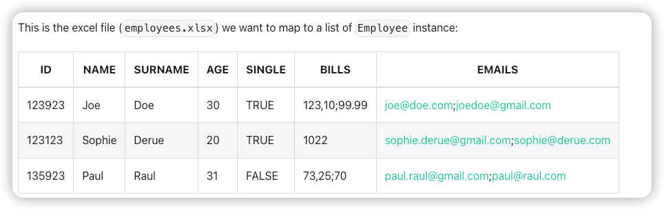

## Java Excel
- https://github.com/topics/excelwriter?l=java
- https://github.com/javaxcel/javaxcel-core


## Poiji Usage


## Annotations

- ExcelRow
- ExcelCell
- ExcelCellName
- ExcelSheet
```java
@ExcelSheet("Sheet2")  (1)
public class Employee {

    @ExcelRow                    <1>
    private int rowIndex;

    @ExcelCell(0)                <2>
    private long employeeId;     <3>

    @ExcelCell(1)
    private String name;

    @ExcelCell(2)
    private String surname;

    @ExcelCell(3)
    private int age;

    @ExcelCell(4)
    private boolean single;

    @ExcelCellName("emails")     <4>
    List<String> emails;

    @ExcelCell(5)
    List<BigDecimal> bills;

    //no need getters/setters to map excel cells to fields
}
```



```java
PoijiOptions options = PoijiOptions.PoijiOptionsBuilder.settings()
        .addListDelimiter(";") <1>
        .build();
List<Employee> employees = Poiji.fromExcel(new File("employees.xls"), Employee.class, options);
// alternatively
InputStream stream = new FileInputStream(new File("employees.xls"))
List<Employee> employees = Poiji.fromExcel(stream, PoijiExcelType.XLS, Employee.class, options);

employees.size();
// 3
Employee firstEmployee = employees.get(0);
// Employee{rowIndex=1, employeeId=123923, name='Joe', surname='Doe', age=30, single=true, emails=[joe@doe.com, joedoe@gmail.com], biils=[123,10, 99.99]}
```


## For POI Sheet Object

```shell
File file = new File("/tmp/file.xlsx");
FileInputStream fileInputStream = new FileInputStream(file);
Workbook workbook = new XSSFWorkbook(fileInputStream);
Sheet sheet = workbook.getSheetAt(0);

List<Model> result = Poiji.fromExcel(sheet, Model.class);
```